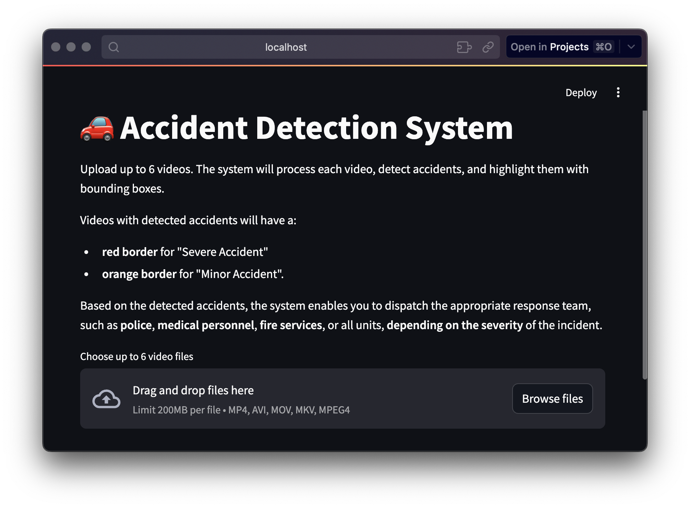
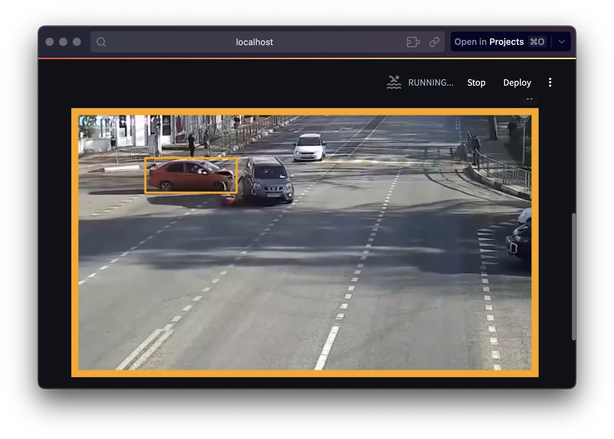
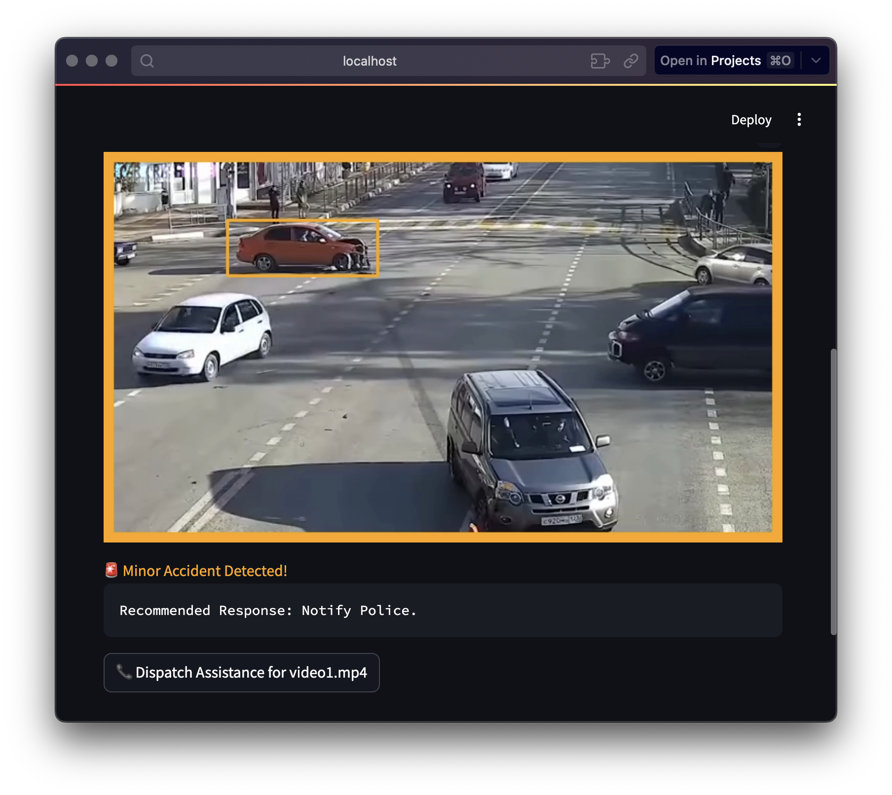
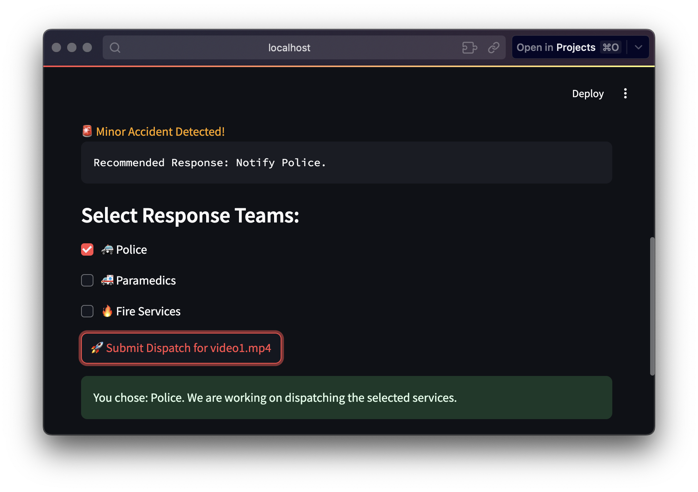

# Detekce nehod a klasifikace závažnosti pomocí YOLOv8

## Table of Contents
  - [Motivace](#motivace)
  - [Demo Aplikace](#demo-aplikace)
    - [Funkce Demo Aplikace](#funkce-demo-aplikace)
    - [Instalace](#instalace)
    - [Screenshoty z Aplikace](#screenshoty-z-aplikace)
      - [Hlavní obrazovka](#hlavní-obrazovka)
      - [Ukázka detekce nehody](#ukázka-detekce-nehody)

---

## Motivace

Po dopravní nehodě se počítá každá vteřina. Zpožděná reakční doba může znamenat rozdíl mezi životem a smrtí, zatímco nepřesné informace o závažnosti nehody mohou vést k nesprávnému přidělování zdrojů, což vytváří další neefektivitu záchranných služeb. 

Tento projekt si klade za cíl tento proces změnit pomocí **Systému detekce a klasifikace závažnosti dopravních nehod**. Při zjištění nehody systém analyzuje její závažnost a určuje, jakou složku zachranného systému je potřeba informovat - ať už jde o záchranáře, hasiče nebo orgány činné v trestním řízení. Tento přístup výrazně zkracuje dobu odezvy a zajišťuje, že správné zdroje jsou bez prodlení nasazeny na správné místo.

**Proč je to důležité?**
- **Rychlejší reakce na mimořádné události**: Automatická detekce a klasifikace závažnosti znamená, že pomoc dorazí dříve, což zachrání životy a minimalizuje zranění.
- **Přesné přidělování zdrojů**: Vyhodnocením závažnosti nehody v reálném čase systém zajistí vhodné nasazení zdravotnického, hasičského nebo policejního personálu a zabrání tak plýtvání zdroji.
- **Snížení počtu lidských chyb**: Automatizace procesu detekce a klasifikace odstraňuje závislost na někdy panických nebo nejasných hlášeních očitých svědků.

---

## Demo Aplikace

### Funkce Demo Aplikace
- Detekce dopravních nehod v reálném čase.
- Klasifikace závažnosti do tří kategorií:
  - **Vážná nehoda (Severe Accident)**
  - **Méně závažná nehoda (Minor Accident)**
  - **Žádná nehoda (No Accident)**
- Uživatelsky přívětivé rozhraní pro intuitivní ovládání.
- Integrovaná databáze pro ukládání snímků a zpracovaných dat o nehodách.

### Instalace

1. Klonování úložiště git
    ```bash
        git clone https://github.com/....
    ```
2. Přejděte do složky s Demo Aplikací
    ```bash
        cd Accident-Detection-DEMO
    ```

3. Ujistěte se, že máte nainstalované všechny požadované balíčky:
   ```bash
        pip install -r requirements.txt
   ```

4. Spusťte aplikaci Streamlit příkazem:
   ```bash
        streamlit run app.py
   ```

5. Otevřete aplikaci ve webovém prohlížeči. Výchozí adresa je:
   ```
        http://localhost:8501
   ```

### Screenshoty z Aplikace

#### Hlavní obrazovka


#### Ukázka detekce nehody




---

